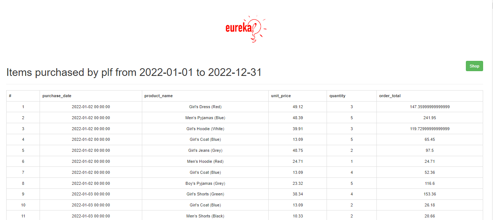
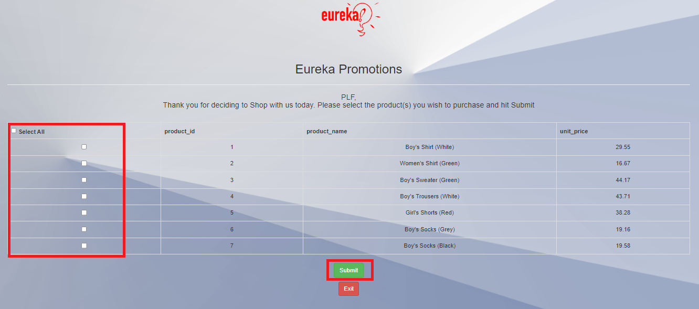

# Develop MySQL HeatWave App with LAMP

## Introduction

MySQL HeatWave can easily be used for development tasks with existing Oracle services, such as Oracle Analytics Cloud. New applications can also be created with the LAMP or other software stacks.

**Note:** This application code is intended for educational purposes only. It is designed to help developers learn and practice application development skills with MySQL HeatWave on OCI. The code is not designed to be used in a production environment

_Estimated Lab Time:_ 15 minutes

### Objectives

In this lab, you will be guided through the following tasks:

- Create MySQL HeatWave / PHP connect app
- Create GoogLe Chart Application
- Create LAMP WEB Application

### Prerequisites

- An Oracle Trial or Paid Cloud Account
- Some Experience with MySQL SQL and  PHP
- Completed Lab 10


## Task 1: Create MySQL HeatWave / PHP connect app

1. Create config.php

    ```bash
    <copy>cd /var/www/html</copy>
    ```

    ```bash
    <copy>sudo nano config.php</copy>
    ```

2. Add the following code to the editor and save the file (ctr + o) (ctl + x)

     ```bash
        <copy><?php
    // Database credentials
    define('DB_SERVER', '10.0.1...');// MDS server IP address
    define('DB_USERNAME', 'admin');
    define('DB_PASSWORD', 'Welcome#12345');
    define('DB_NAME', 'mysql_customer_orders');
    //Attempt to connect to MySQL database
    $link = mysqli_connect(DB_SERVER, DB_USERNAME, DB_PASSWORD, DB_NAME);
    // Check connection
    if($link === false){
        die("ERROR: Could not connect. " . mysqli_connect_error());
    }
    // Print host information
    echo 'Successfull Connect.';
    echo 'Host info: ' . mysqli_get_host_info($link);
    ?>
    </copy>
    ```

    - Test Config.php on Web sever http://150.230..../config.php

3. Create dbtest.php

    ```bash
    <copy>cd /var/www/html</copy>
    ```

    ```bash
    <copy>sudo nano dbtest.php</copy>
    ```

4. Add the following code to the editor and save the file (ctr + o) (ctl + x)

    ```bash
    <copy>
    <?php
    require_once "config.php";
    $query = "select id, vendor_name from DELIVERY_VENDOR limit 5;";
    if ($stmt = $link->prepare($query)) {
    $stmt->execute();
    $stmt->bind_result($id,$vendor_name);
    echo "<table>";
        echo "<tr>";
        echo "<th>ID</th>";
        echo "<th>VendorName</th>";
    echo "</tr>";

    while ($stmt->fetch()) {
        echo "<tr>";
        echo "<td>" . $id ."</td>";
        echo "<td>" . $vendor_name. "</td>";
        echo "</tr>";
    }

    $stmt->close();
    }
    ?>
    </copy>
    ```

5. From your local  machine connect to dbtest.php 

    Example: http://129.213.167..../dbtest.php  

    

## Task 2: Create Google Chart Application to display Database and Lakehouse data

1. Go to the development folder

    ```bash
    <copy>cd /var/www/html</copy>
    ```

2. Create mydbchart.php file

    ```bash
    <copy>sudo nano mydbchart.php</copy>
    ```

3. Click on this link to **Download file [orders\_lakehouse\_dbchart.php](files/orders_lakehouse_dbchart.php)**  to your local machine
4. Open orders\_lakehouse\_dbchart.php from your local machine with notepad or VSCODE

5. copy all of the content of the orders\_lakehouse\_dbchart.phpp file from your local machine to the LAMP server  mydbchart.php 
    - add the content to the mydbchart.php file that you are  creating

        
    - Remember to replace the IP address, username, and password (lines 2 and 96 )
        - $con = mysqli_connect('30.0...','admin','Welcome#123','airportdb');
        - $link = mysqli_connect('30.0...','admin','Welcome#123','airportdb');
        
    - Save the mydbchart.php 

6. From your local  machine connect to mydbchart.php

    Example: http://129.213.167..../mydbchart.php

    

## Task 3: Create the e-commerce Application

1. Go to the development folder

    ```bash
    <copy>cd /var/www/html</copy>
    ```

2. Get the Application files  from Object Stogage

    ```bash
    <copy>sudo wget  https://objectstorage.us-ashburn-1.oraclecloud.com/p/bpmpXfQwwE3iTqiVOb-G2oCD3zBFKuxlvtPHsvCMOXHWkV51r3Yapowf0N0g4Dna/n/mysqlpm/b/mysql_customer_orders/o/orders_web.zip</copy>
    ```

3. Unnzip orders_web.zip file

    ```bash
    <copy>sudo unzip orders_web.zip </copy>
    ```

4. Open the config.php file 

    ```bash
    <copy>sudo nano orders_web/config.php </copy>
    ```

    Change config.php by replacing the mysql\_customer\_orders schema 'localhost' with heatwave-db IP address,username, and password;

    - Save the orders_web/config.php
    

## Task 4: Run the e-commerce Application

1. From your local machine connect to heatwave-client IP Address/orders_web/login.php 

    Example: http://999.999.999/orders_web/login.php

2. Login with the following information

    a. username: 

    ```bash
    <copy>plf </copy>
    ```

    b. password:

    ```bash
    <copy>hello123</copy>

    ```

    

3. From the Welcome Page click the "View Account Activity" button

    

4. From the Items purchased Page click the "Shop" button

    

5. From the Promotion Shop Page select Items to purchase and click the "Submitt" button

    

6. From the Items Purchase Page select a "Delivery Location" and  click the  and the  "Continue" button

    

7. From the Thank You  Page   click the "Signout" button

    

## Learn More

[https://dev.mysql.com/doc/heatwave/en/mys-hw-lakehouse.html](https://dev.mysql.com/doc/heatwave/en/mys-hw-lakehouse.html)

## Acknowledgements

- **Author** - Perside Foster, MySQL Solution Engineering

- **Contributors** - Abhinav Agarwal, Senior Principal Product Manager, Nick Mader, MySQL Global Channel Enablement & Strategy Manager
- **Last Updated By/Date** - Perside Foster, MySQL Solution Engineering, May 2023